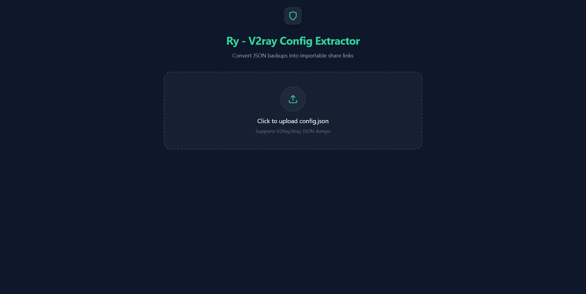

# Ry - V2ray Config Extractor

A professional, client-side tool to parse V2Ray/Xray `config.json` files and extract importable share links (VLESS, Trojan, VMess).
I made this because after building a BPB panel and getting `config.json` file from it, I can convert it to configs links that I can use 😉.
Enjoy it... 

  

> ### 🟢 Privacy Guaranteed
> This application is 100% client-side and **does not** save any user input or data to a database.

## Use it here
[ry-v2ray-config-extractor](https://ryan-pg.github.io/ry-v2ray-config-extractor)

## 🚀 Features

  <table>
    <tr>
      <td align="center"><b>First Page</b></td>
      <td align="center"><b>Extracted Configs</b></td>
    </tr>
    <tr>
      <td></td>
      <td></td>
    </tr>
  </table>

## 🚀 Features

- **Instant Parsing**: Drag and drop your `config.json` backup files directly into the browser.
- **Protocol Support**: Automatically generates standard share links for:
  - `vless://` (Supports XTLS, gRPC, WS, and standard TCP)
  - `trojan://`
  - `vmess://` (Base64 encoded standard format)
- **Smart Extraction**: Detects and extracts individual configurations from complex routing/balancing setups (including "Best Ping" groups).
- **Privacy First**: **100% Client-Side**. No data is uploaded to any server; everything runs strictly in your browser.
- **One-Click Copy**: Copy individual links or the entire list at once.
- **Modern UI**: Built with Tailwind CSS for a sleek, responsive dark-mode experience.

## 🛠️ How to Use

1. **Open the App**: Launch the site or open `index.html` locally.
2. **Upload**: Click the upload area or drag your `config.json` file onto the page.
3. **Review**: The app lists all valid proxy configurations found in the file, preserving their remarks.
4. **Export**:
   - Click the copy icon next to a specific config to copy that link.
   - Click **"Copy All Configs"** to copy the entire list to your clipboard (useful for mass importing into V2RayNG, Necoray, etc.).

## 📦 Deployment

This is a **standalone** application contained in a single `index.html` file. It utilizes CDN imports and requires no Node.js build step.

### Option 1: Cloudflare Pages (Recommended)
1. Create a repository (GitHub/GitLab) and push the `index.html` file.
2. Log in to [Cloudflare Dashboard](https://dash.cloudflare.com/) > **Workers & Pages**.
3. Click **Create Application** > **Pages** > **Connect to Git**.
4. Select your repository.
5. **Build settings**: Leave completely empty (Framework preset: None).
6. Click **Deploy**.

### Option 2: Local Use
Simply download `index.html` and open it in any modern web browser (Chrome, Edge, Firefox, Safari).

## 💻 Tech Stack

- **React 18**: UI logic (loaded via ESM).
- **Tailwind CSS**: Styling (loaded via CDN).
- **Lucide React**: Iconography.
- **Babel Standalone**: In-browser JSX compilation.

## 🔒 Privacy & Security

This tool is designed to be safe for handling sensitive configuration data:
- **No Backend**: There is no server-side code.
- **Local Processing**: Your keys, UUIDs, and passwords never leave your browser memory.
- **No Analytics**: No tracking scripts are included.

## 📄 License

This repository is licensed under the MIT License. See the LICENSE file for more details.
